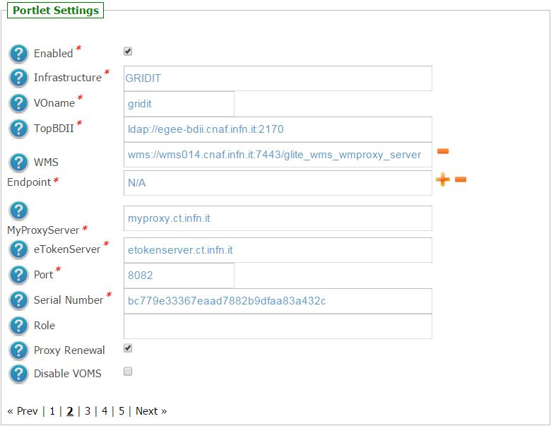
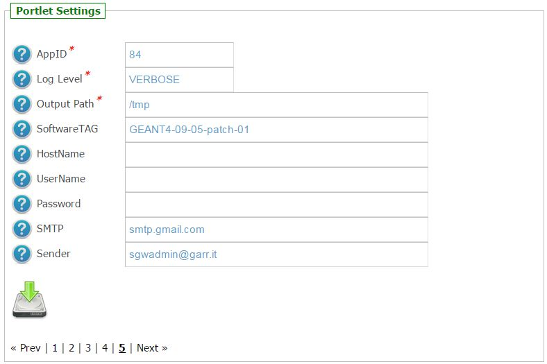
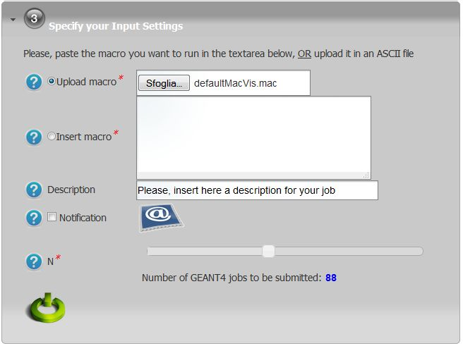

*********************
FRATT v1.1.1 Docs
*********************

============
About
============

.. _1: http://www.ro-journal.com/content/8/1/80
.. _INFN_LNS: http://www.lns.infn.it/
.. _GEANT4: http://geant4.cern.ch/

The application simulates the FRATT (FRAgmentation in Thick Targets) experimental setup performed at INFN_LNS_. The simulation reproduces the fragmentation of carbon ions in tissue equivalent targets (i.e. bone, lung and muscle). When the simulation has finished, a comparison between experimental and simulated data is also provided.

Hadrontherapy with carbon ions is a novel technique of high precision external radiotherapy. It offers, in respect to conventional radiotherapy, interesting advantages yielding a better perspective for tumor treatment. Indeed, ion therapy allows for a higher tumor dose (sparing normal tissues in the entrance channel), steeper dose gradients and higher radiobiological effectiveness. (In particular, carbon ions are actually considered the optimal choice for the treatment of deep-seated radio-resistant tumors.)

The only disadvantage of the ion therapy concerns the production of secondary charged particles because of the nuclear fragmentation process affecting the primary beam. Due to this reason we created an application using the Montecarlo simulation toolkit GEANT4_, to have a comparison between experimental data and simulations about fragmentation of carbon ions in equivalent tissue (e.g. bone, muscle, lung).

Another important reason of FRATT application is to validate hadronic physics models present in GEANT4_, e.g. Binary Cascade and QMD, because in the range of interest in hadrontherapy (60-400 MeV/u) there are not enough data about nuclear fragmentation.

Hadronic models validation could be very useful in the early future to create new TPS (Treatment Planning Sistem) in treatments with carbon ions.

============
Installation
============
To install this portlet the WAR file has to be deployed into the application server.

As soon as the portlet has been successfully deployed on the Science Gateway the administrator has to configure:

- the list of e-Infrastructures where the application can be executed;

- some additional application settings.

1.) To configure a generic e-Infrastructure, the following settings have to be provided:

**Enabled**: A true/false flag which enables or disable the generic e-Infrastructure;

**Infrastructure**: The acronym to reference the e-Infrastructure;

**VOName**: The VO for this e-Infrastructure;

**TopBDII**: The Top BDII for this e-Infrastructure;

**WMS Endpoint**: A list of WMS endpoint for this e-Infrastructure (max. 10);

**MyProxyServer**: The MyProxyServer for this e-Infrastructure;

**eTokenServer**: The eTokenServer for this e-Infrastructure;

**Port**: The eTokenServer port for this e-Infrastructure;

**Serial Number**: The MD5SUM of the robot certificate to be used for this e-Infrastructure;

In the following figure is shown how the portlet has been configured to run simulation on the Italian e-Infrastructure.

2.) To configure the application, the following settings have to be provided:

**AppID**: The ApplicationID as registered in the UserTracking MySQL database (GridOperations table);

**Software TAG**: The list of software tags requested by the application;

**SMTP Host**: The SMTP server used to send notification to users;

**Sender**: The FROM e-mail address to send notification messages about the jobs execution to users;

.. _GARR: https://sgw.garr.it/

In the figure below is shown how the application settings have been configured to run on the GARR_ Science Gateway.

============
Usage
============

To run the Monte Carlo simulations the user has to:

- click on the *third* accordion of the portlet,

- upload the macro as ASCII file OR paste its content in the below textarea, and

- select the number of jobs to be executed as shown in the below figure:

Each simulation will produce:

- *std.txt*: the standard output file;

- *std.err*: the standard error file;

- *.tar.gz*: containing the results of the Monte Carlo simulation.

A typical simulation produces, at the end, the following files:

.. code:: bash

        ]$ tree IortTherapySimulationStarted_646/
        IortTherapySimulationStarted_646/
        ├── std.err
        ├── std.txt
        ├── output.README
        └── results.tar.gz

============
Support
============
Please feel free to contact us any time if you have any questions or comments.

.. _INFN: http://www.ct.infn.it/
.. _INFN_LNS: http://www.lns.infn.it/

:Authors:
 
 `Roberto BARBERA <mailto:roberto.barbera@ct.infn.it>`_ - Italian National Institute of Nuclear Physics (INFN_),

 `Davide D'URSO <mailto:davide.durso@hotmail.it>`_ - Italian National Institute of Nuclear Physics (LNS) INFN_LNS_,
  
 `Giuseppe Antonio Pablo CIRRONE <mailto:cirrone@gmail.com>`_ - Italian National Institute of Nuclear Physics (LNS) INFN_LNS_,
 
 `Giuseppe LA ROCCA <mailto:giuseppe.larocca@ct.infn.it>`_ - Italian National Institute of Nuclear Physics (INFN_),
 
 `Francesco ROMANO <mailto:francesco.romano@lns.infn.it>`_ - Italian National Institute of Nuclear Physics (LNS) INFN_LNS_,
 
:Version: v1.1.1, 2015

:Date: June 1st, 2015 11:45
